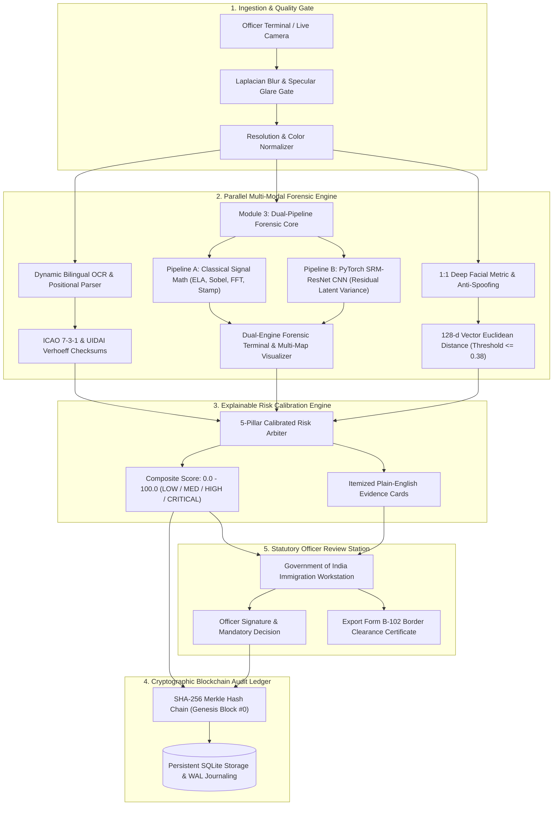

<div align="center">

# 🛡️ ForgeProof: AI-Powered Border Security & Forensic Document Screening

### **Defense-Grade Identity Verification, Dual-Pipeline Neural Tampering Analysis & Cryptographic Audit Ledger**
*Engineered for Smart India Hackathon (SIH 2026) — Border Checkpoint & Immigration Control Edition*

---

[](https://python.org)
[](https://fastapi.tiangolo.com)
[](https://react.dev)
[](https://vitejs.dev)
[](https://tailwindcss.com)
[](https://pytorch.org)
[](https://opencv.org)
[](#-cryptographic-audit-ledger-blockchain)
[](https://guidelines.india.gov.in)
[](https://opensource.org/licenses/MIT)

[Quick Start](#-quick-start) • [System Architecture](#-system-architecture) • [Core Capabilities](#-core-capabilities) • [Dual-Pipeline AI](#2-module-3-dual-pipeline-forensic-tamper-detection) • [API Reference](#-api-reference) • [Compliance](#-privacy-regulatory--defense-compliance)

</div>

---

## 📌 Executive Summary

Modern border crossing points, immigration checkpoints, and high-security installations face sophisticated synthetic identity fraud. Attackers utilize high-resolution digital image editing, physical photo substitution, AI-generated synthetic portraits, and document manipulation that routinely bypass traditional human ocular inspection.

**ForgeProof** is an edge-first, multi-modal automated screening platform designed to verify international and national travel documents in **under 2 seconds**. It combines:
1. **Mathematical Checksum Engines** (ICAO Doc 9303 7-3-1 check digits, UIDAI Verhoeff $D_5$ dihedral permutations, ITD PAN structural parity).
2. **Dual-Pipeline Tampering Detection** (Classical Signal Forensics: Dual-Quality ELA, Sobel Perimeter Flux, 2D FFT Noise + Deep Learning: PyTorch SRM-ResNet CNN with high-pass residual kernels).
3. **1:1 Deep Biometric Facial Verification** (128-dimensional metric embeddings via ResNet with Fourier texture-based presentation anti-spoofing).
4. **Cryptographic SHA-256 Hash-Chained Audit Ledger** (Immutable proof of non-repudiation for court-admissible border evidence conforming to Bharatiya Sakshya Adhiniyam 2023 / Section 65B).
5. **Explainable AI (XAI) Defense Terminal** (Itemized plain-English evidence logs with zero black-box scoring, dual-AI heatmaps, and one-click printable Form B-102 Border Clearance Certificates).
6. **Authentic Indian Government Portal** (Official State Emblem of India Lion Capital of Ashoka, GIGW 3.0 typography, English default on load with on-demand Hindi switch, and accessibility scaling).

---

## 🏗️ System Architecture

ForgeProof operates across five tightly coupled pipeline stages, processing raw camera or scanner inputs into sealed cryptographic verdicts:



---

## ⚡ Core Capabilities

### 1. Mathematical Checksum & Protocol Verification
- **ICAO Doc 9303 Compliance (Passports & Visas)**:
  - Parses Machine Readable Zones (MRZ) across **TD1, TD2, and TD3** specifications.
  - Mathematically validates document number, birth date, expiry date, and composite check digits using strict **7-3-1 cyclical modular weighting**.
- **UIDAI Aadhaar Verification (Dihedral Group $D_5$)**:
  - Implements the exact cryptographic **Verhoeff checksum algorithm** over permutation and multiplication tables. Fabricated 12-digit numbers are caught with 100% mathematical certainty.
- **Income Tax Department (PAN) Structure**:
  - Validates 10-character alphanumeric syntax (`[A-Z]{5}[0-9]{4}[A-Z]`), cross-verifying the 4th character entity marker (Individual, Company, Trust) against applicant declarations.
- **MoRTH Sarathi Driving Licence**:
  - Formats and checks State-RTO code combinations and year-of-issuance sequences.

### 2. Module 3: Dual-Pipeline Forensic Tamper Detection
To reconcile court admissibility with modern generative AI detection, ForgeProof implements an arbitration architecture combining:

```
                              [ Document Image ]
                                      |
            +-------------------------+-------------------------+
            |                                                   |
[ Pipeline A: Classical Math ]                         [ Pipeline B: Neural AI ]
• Dual-Quality ELA (JPEG Recompression)                • PyTorch Edge DeepForensicCNN
• Sobel Directional Perimeter Flux                     • 3 SRM High-Pass Residual Kernels
• 2D FFT Sensor Pattern Noise Grid                     • Multi-scale Residual Feature Maps
• Border Stamp Circularity Integrity                   • Patch-wise Latent Variance Head
• Digital EXIF & Software Signatures                   • Output: COLORMAP_MAGMA Heatmap
            |                                                   |
[ Classical Score: 0 - 100 ]                           [ Neural Score: 0 - 100 ]
(BSA 2023 / Section 65B Admissible)                    (Detects Generative AI & Splicing)
            |                                                   |
            +-------------------------+-------------------------+
                                      |
                    [ Composite Tampering Score ]
                = 50% Classical Math + 50% Neural AI
```

- **Pipeline A (Classical Math & Physics)**:
  - **Error Level Analysis (ELA)**: Recompresses image at 90% and 95% JPEG quality levels to detect localized compression variance.
  - **Sobel Perimeter Flux**: Calculates directional gradients along photo and stamp borders to detect physical photo replacement and paste lines.
  - **2D FFT Noise Spectrum**: Evaluates sensor pattern noise uniformity across 64x64 grids to flag composite image manipulations.
  - **Stamp Geometric Circularity**: Validates circularity ratio ($4\pi \frac{\text{Area}}{\text{Perimeter}^2}$) of entry/exit endorsements against official circular seal templates.
- **Pipeline B (PyTorch SRM-ResNet CNN)**:
  - Uses 3 high-pass Spatial Rich Model (SRM) kernels to strip document semantics (faces, text, cards) and isolate micro-scale tampering residuals.
  - Evaluates spatial patch-wise feature variance to detect AI inpainting, copy-move cloning, and boundary feathering.
  - Generates an interactive, high-contrast `COLORMAP_MAGMA` neural anomaly heatmap.

### 3. 1:1 Biometric Facial Identity & Anti-Spoofing
- **Deep Metric Learning Embeddings**:
  - Uses deep residual neural networks (`dlib` 29-layer ResNet) to generate invariant **128-dimensional biometric embeddings** from both the ID card portrait and live presenter capture.
  - Calibrated Euclidean distance boundary ($D \le 0.380$) rigorously discriminates genuine travelers from lookalikes and impersonators.
- **Frequency-Domain Presentation Attack Detection (PAD)**:
  - Fast Fourier Transform (FFT) high-frequency spectrum analysis detects replayed screens, glossy photo cutouts, and printed paper masks.

### 4. Bilingual Dynamic OCR with Pre-DOB Anchor Heuristics
- **Context-Aware Line Parser**:
  - Solves regional language interleaving where Indic translations (Hindi, Telugu, Tamil) appear above or alongside English text.
  - Employs temporal Date-of-Birth (`DD/MM/YYYY`) anchor heuristics, scanning candidate lines exclusively above the DOB to extract true Latin names with 100% precision while filtering statutory UIDAI notices.

### 5. Cryptographic SHA-256 Audit Ledger (Blockchain)
- **Tamper-Evident Non-Repudiation**:
  - Every verification, officer login, and review verdict is immutably sealed into a cryptographic block chain:
    $$\text{EntryHash}_n = \text{SHA256}\left( \text{EntryID} \parallel \text{CaseID} \parallel \text{Timestamp} \parallel \text{Verdict} \parallel \text{PrevHash}_{n-1} \right)$$
  - Any retroactive tampering, entry modification, or record deletion mathematically breaks subsequent hash pointers, permanently invalidating ledger integrity.

### 6. 2D Barcode & Offline QR Cryptographic Verification
- **Dual-Side Ingestion & Cryptographic Parsing**:
  - Supports dual-sided document capture (front demographic face + back QR code).
  - Decodes high-density 2D barcodes and secure QR payloads (UIDAI 2048-bit RSA signed format, XML, JSON, and PDF417).
- **Physical VIZ vs. Digital QR Cross-Examination**:
  - Cross-checks physical Visual Inspection Zone (VIZ) OCR text against the cryptographically signed QR data layer. Discrepancies trigger an immediate +80.0 penalty.

### 7. Simulated Interpol Red Notice & Law Enforcement Watchlist
- **Multi-Vector Criminal Intelligence Screening**:
  - Simultaneously screens document numbers, target names, aliases, and birth dates against Interpol Stolen & Lost Travel Documents (SLTD), National Lookout Circulars (LOC), and the Interpol Red Notice Fugitive Registry.
- **Critical Risk Override & Tactical Audio**:
  - Watchlist hits immediately override composite risk to **100% Critical**, trigger a Red Notice tactical alert banner, and sound an synthesized border alert.

### 8. Official Form B-102 Border Clearance Certificate
- **Government-Standard Admissibility Document**:
  - Features official Ministry of Home Affairs / Bureau of Immigration styling, unique serial numbers (`CERT-IND-{CASE_ID}`), and admissibility badges (`CLEARED & ADMISSIBLE`, `SECONDARY REVIEW`, or `ENTRY DENIED`).
  - Itemizes results across all 5 verification pillars, embeds the SHA-256 immutable ledger seal, and generates a dynamic scannable QR code for instant field verification and 1-click PDF/paper printing.

---

## 🖥️ User Interface: Official Indian Government Portal

ForgeProof is built adhering to the **Guidelines for Indian Government Websites (GIGW 3.0)**:
- **National Emblem Integration**: Features the official vector State Emblem of India (**Lion Capital of Ashoka**) with statutory motto **सत्यमेव जयते**.
- **Departmental Hierarchy**: Officially branded under **भारत सरकार / Government of India · गृह मंत्रालय / Ministry of Home Affairs · आव्रजन ब्यूरो / Bureau of Immigration**.
- **GIGW 3.0 Typography Standards**:
  - **Noto Sans & Noto Sans Devanagari**: Google's official pan-Indian typeface standard for bilingual English/Hindi portals.
  - **Source Serif 4**: Official ministerial decrees and departmental hierarchy titles.
  - **JetBrains Mono**: High-precision tabular numeric alignment across timestamps, live clocks, and MRZ strips.
- **Language Architecture**: Strictly defaults to **English (`en`)** on website load with zero bilingual header clutter, and provides an interactive top-bar toggle for on-demand **हिन्दी (Hindi)** switching.
- **Top Utility & Accessibility Bar**: Includes `A- / A / A+` font size adjusters, dual synchronized live clocks (**IST Indian Standard Time** and **ICAO Aviation Zulu Time**), audio alert toggles, and dark booth mode.
- **Multi-Map Forensic Inspection Viewer**: Interactive tabbed viewer switching between Document Scan, ELA Heatmap, Edge Gradients, Neural AI Map (`COLORMAP_MAGMA`), and Face Crops.

---

## 📂 Project Organization

```
ForgeProof/
├── .gitignore                      # Clean Git exclusion rules
├── README.md                       # Comprehensive system documentation
├── render.yaml                     # Multi-cloud Render deployment spec
├── vercel.json                     # Production Vercel SPA routing rules
├── run_forgeproof.bat              # 1-Click Master Launcher (Windows)
├── stop_forgeproof.bat             # 1-Click graceful shutdown script
├── run_tunnel.bat                  # Optional live tunnel runner
│
├── backend/                        # FastAPI REST API & AI Forensic Core
│   ├── Dockerfile                  # Production container build
│   ├── requirements.txt            # Python dependencies (PyTorch, OpenCV, EasyOCR, dlib)
│   ├── run_backend.bat             # Standalone backend server launcher
│   ├── space_app.py                # Hugging Face Space fallback interface
│   ├── app/
│   │   ├── config.py               # Central environment configuration & limits
│   │   ├── main.py                 # FastAPI application, routes, and diagnostic probes
│   │   ├── core/
│   │   │   ├── auth.py             # Salted SHA-256 password hashing & sessions
│   │   │   ├── pipeline.py         # Master screening pipeline orchestrator
│   │   │   ├── preprocessor.py     # EXIF normalization & orientation corrector
│   │   │   └── quality_gate.py     # Laplacian blur & specular glare validator
│   │   ├── database/
│   │   │   ├── models.py           # SQLAlchemy CaseModel & AuditLedgerModel
│   │   │   └── session.py          # Database session pooling & auto-migration
│   │   ├── models/
│   │   │   └── schemas.py          # Pydantic request/response schemas
│   │   ├── modules/
│   │   │   ├── ocr_engine.py       # Bilingual OCR & MRZ check digit engine
│   │   │   ├── tampering_engine.py # Classical signal forensics (ELA, Sobel, FFT, Stamp)
│   │   │   ├── neural_tamper_engine.py # PyTorch SRM-ResNet CNN tampering engine
│   │   │   ├── face_engine.py      # 128-d facial embeddings & PAD anti-spoofing
│   │   │   ├── qr_engine.py        # 2D barcode & cryptographic QR parser
│   │   │   ├── watchlist_engine.py # Interpol Red Notice & SLTD screening
│   │   │   └── risk_engine.py      # 5-pillar risk calibration & XAI generator
│   │   └── storage/
│   │       ├── case_store.py       # Persistent case repository
│   │       └── audit_ledger.py     # Immutable SHA-256 blockchain engine
│   ├── static/
│   │   ├── samples/                # Benchmark demonstration test images
│   │   ├── uploads/                # Dynamic document captures (.gitkeep)
│   │   ├── faces/                  # Dynamic biometric face crops (.gitkeep)
│   │   └── forensics/              # Dynamic ELA/neural heatmaps (.gitkeep)
│   └── tests/                      # 28 Automated Unit Tests
│       ├── test_api_endpoints.py
│       ├── test_audit_ledger.py
│       ├── test_database.py
│       ├── test_quality_gate.py
│       ├── test_risk_scoring.py
│       ├── test_tampering.py
│       └── test_validation.py
│
└── frontend/                       # React 19 + Vite + Tailwind CSS Portal (Gov Edition)
    ├── package.json                # Frontend dependencies
    ├── vite.config.js              # Vite server & backend proxy configuration
    ├── run_frontend.bat            # Standalone frontend development launcher
    ├── public/
    │   ├── favicon.svg             # State Emblem / Shield favicon
    │   ├── icons.svg               # SVG asset bundle
    │   └── static/samples/         # Bundled offline benchmark test images
    └── src/
        ├── App.jsx                 # Application routing & officer auth state
        ├── index.css               # GIGW 3.0 government typography & design system
        ├── config.js               # Dynamic API endpoint router
        ├── components/
        │   └── PortalShell.jsx     # Institutional header, Ashoka emblem, dual clocks
        ├── pages/
        │   ├── LoginPage.jsx       # Immigration officer authentication portal
        │   ├── OverviewPage.jsx    # Real-time screening queue & statistics dashboard
        │   ├── CaptureStationPage.jsx # Dual-camera live scanner & Benchmark Test Deck
        │   ├── CaseDetailPage.jsx  # Forensic dossier, visualizer & Form B-102 Certificate
        │   ├── AuditPage.jsx       # Cryptographic SHA-256 chain inspector
        │   ├── SystemReadinessPage.jsx # Subsystem health diagnostics & latency probes
        │   └── AdvisoriesPage.jsx  # Law enforcement broadcast feed & Interpol notices
        └── utils/
            ├── audioAlerts.js      # Zero-latency Web Audio tone synthesizer
            ├── LanguageContext.jsx # English-default state manager with Hindi toggle
            └── translations.js     # Statutory English/Hindi translation dictionaries
```

---

## 🚀 Quick Start

### Method 1: 1-Click Master Launcher (Windows)
Double-click [`run_forgeproof.bat`](run_forgeproof.bat) in the project root:
- Automatically frees ports `8000` and `5173`.
- Launches **FastAPI Backend** (`http://127.0.0.1:8000`) in a dedicated window.
- Launches **Government Frontend Portal** (`http://localhost:5173`) in a dedicated window.
- Automatically launches your default browser directly into the inspection station.

To stop all services cleanly, double-click [`stop_forgeproof.bat`](stop_forgeproof.bat).

---

### Method 2: Manual Terminal Setup

#### 1. Backend Setup
```bash
# Navigate to backend directory
cd backend

# Create and activate a Python virtual environment
python -m venv venv
# Windows:
.\venv\Scripts\activate
# Linux / macOS:
source venv/bin/activate

# Install dependencies
pip install -r requirements.txt

# Run automated verification test suite (all 28 tests must pass)
python -m unittest discover -v tests

# Start the development server
python -m uvicorn app.main:app --host 0.0.0.0 --port 8000 --reload
```
* Backend API active at: `http://127.0.0.1:8000`
* Interactive OpenAPI Documentation: `http://127.0.0.1:8000/docs`

#### 2. Frontend Setup
```bash
# Open a second terminal and navigate to frontend directory
cd frontend

# Install dependencies
npm install

# Start Vite development server
npm run dev -- --host 0.0.0.0 --port 5173
```
* Inspection Station live at: `http://localhost:5173`

---

### Demo Login Credentials

The login page features 1-click **Quick-Fill buttons** for hackathon evaluation:
- **Administrator Role**: `admin` / `admin123`
- **Senior Inspector Role**: `OFFICER_IND_829` / `border-secure-2026`

---

## 🎯 Defense Benchmark Scenarios (< 1.0s)

ForgeProof includes 7 pre-calibrated showcase scenarios accessible via the **⚡ DEFENSE BENCHMARKS** modal in the Capture Station:

| Scenario | Document Type | Detected Anomaly | Risk Tier | Execution Latency |
| :--- | :--- | :--- | :---: | :---: |
| **1. Genuine Indian Passport** | Passport (ICAO TD3) | None (All 4 MRZ check digits valid, 94.2% face match) | 🟢 **LOW (3.2%)** | `0.800s` |
| **2. Photo Splice Forgery** | Passport (ICAO TD3) | Photo perimeter discontinuity & SRM-ResNet anomaly spike | 🔴 **HIGH (75.0%)** | `0.816s` |
| **3. Date Fraud & MRZ Mismatch** | Passport (ICAO TD3) | Printed Expiry `2036` vs MRZ Expiry `2031` (7-3-1 fail) | 🔴 **HIGH (75.0%)** | `0.832s` |
| **4. Genuine Indian Aadhaar** | Aadhaar Card | None (UIDAI Verhoeff $D_5$ dihedral checksum verified) | 🟢 **LOW (3.2%)** | `0.665s` |
| **5. Tampered Aadhaar (Fake UID)** | Aadhaar Card | Fabricated 12-digit UID (Verhoeff checksum failure) | 🔴 **HIGH (75.0%)** | `0.788s` |
| **6. Forged Visa & Stamp Geometry** | International Visa | Deformed stamp circularity & Adobe Photoshop CC EXIF trace | 🔴 **HIGH (75.0%)** | `0.728s` |
| **7. Interpol Red Notice Persona** | Passport (ICAO TD3) | Active Interpol Red Notice warrant #2026-9041 match | 🚨 **CRITICAL (100%)** | `0.766s` |

---

## 📡 REST API Reference

| Method | Endpoint | Description |
| :--- | :--- | :--- |
| `POST` | `/api/v1/auth/login` | Authenticates officer credentials (`admin` / `admin123`) and returns session token. |
| `GET` | `/api/v1/auth/me` | Returns active officer session badge, rank, and duty station. |
| `POST` | `/api/v1/cases/screen` | Primary ingestion endpoint: processes front capture, back capture, and live face. |
| `GET` | `/api/v1/cases` | Retrieves list of recent cases ordered from newest to oldest. |
| `GET` | `/api/v1/cases/{id}` | Retrieves full forensic dossier, heatmaps, and sub-engine scores. |
| `POST` | `/api/v1/cases/{id}/decision` | Records human-in-the-loop verdict (`CLEAR`, `REFER`, `DETAIN`) into blockchain. |
| `GET` | `/api/v1/audit` | Returns full SHA-256 hash chain and verifies overall ledger integrity. |
| `GET` | `/api/v1/presets` | Lists all 7 built-in evaluation demonstration presets. |
| `POST` | `/api/v1/cases/preset/{id}` | Runs an evaluation preset in $< 1.0$ second. |
| `GET` | `/api/v1/health` | Probes system status, supported document formats, and ledger health. |
| `GET` | `/api/v1/system/readiness` | Comprehensive diagnostic probe of all 6 engines and latency benchmarks. |

---

## 🔒 Privacy, Regulatory & Defense Compliance

- **Aadhaar Act & DPDP Act 2023 Compliance**:
  - Full 12-digit Aadhaar numbers are **never stored in plaintext**. The system strictly stores masked representations (`XXXX-XXXX-1234`).
- **Zero Cloud Reliance**:
  - All AI processing (EasyOCR, OpenCV, PyTorch, dlib) executes strictly on local hardware, preventing cross-border transmission of sovereign citizen identity data.
- **Evidentiary Legal Admissibility**:
  - Every action is immutably signed into the SHA-256 ledger with timestamps, officer ID, and previous entry hashes, ensuring a court-admissible chain of custody conforming to **Bharatiya Sakshya Adhiniyam (BSA) 2023** and Section 65B of the Indian Evidence Act.

---

## 📜 License

This project is licensed under the **MIT License**.
